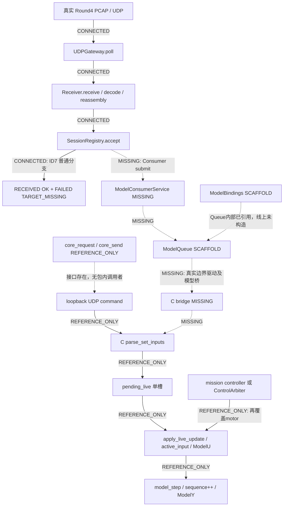
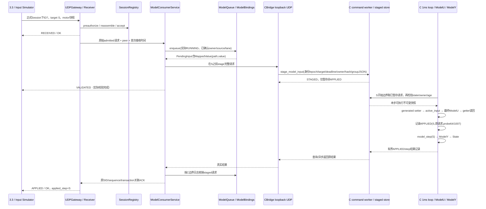
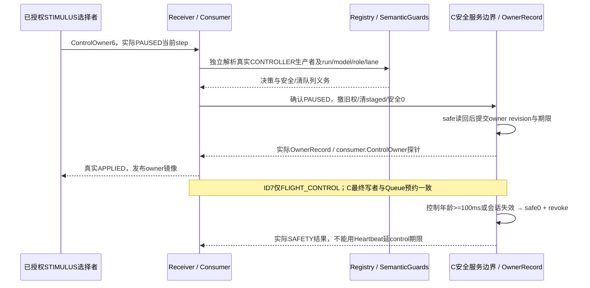
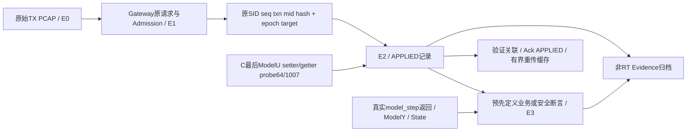
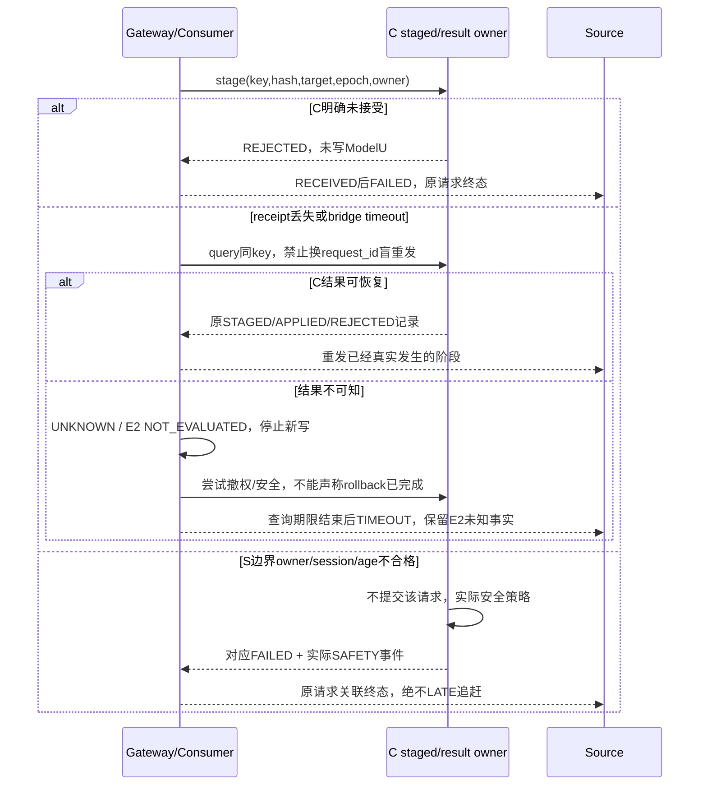

# HISTORY PCAP Round 5：Model Consumer Architecture Review

日期：2026-10-07（Asia/Shanghai）  
范围：`code_handoff_33_36_20261006` 交接包源码、冻结 v0.3、Round 4 持久证据。  
状态：**ARCHITECTURE_REVIEW_COMPLETED / IMPLEMENTATION_NOT_STARTED**。本状态只表示审查交付，不表示模型接入通过。  
授权依据：`prompt_round5_model_consumer_architecture_review_20261007.md`；本轮仅新增本报告。

结论标签：**已确认**＝本包源码/冻结契约/本次只读检查直接支持；**合理推测**＝基于证据作出的推荐设计，尚未实施；**待确认**＝需要包外生成模型、目标运行或后续接口评审。以下设计表中“合理推测”表示推荐决策，不表示现有功能。源码引用的行号以本次读取版本为准。

## 1. Executive Summary

1. **已确认**：实际新 ICD 链止于 `Receiver.receive → SessionRegistry.accept → RECEIVED/OK → FAILED/TARGET_MISSING`。普通 ID7 没有 `ModelQueue.enqueue` 调用；启动入口甚至没有构造 Queue/Bindings（`receiver.py:192–230`、`__main__.py:24–31`）。
2. **已确认**：ModelBindings 和 ModelQueue 是有测试的共用基础库；不是已接线的 Consumer。前者只产出不可变 MappedValue，后者只产出 PendingInput/StepBatch，不写 ModelU、不产生 E2。
3. **已确认**：旧 C 路径中 `set_inputs` 原子提交的是单槽 `pending_live`，receipt 紧随 pending 提交发送；`effective_sequence=sequence+1` 是预期值，不是实际目标步完成证明。多个请求可以合并/替换（`main_rt.c:331–377`、`114–137`）。
4. **已确认**：更关键的断点是 **motor_command 二次覆盖**：`apply_live_update()` 写 ModelU 后，mission controller 或 arbiter 又调用 `write_actuator_command()`，随后才 `model_step()`（`main_rt.c:1027–1048`）。直接适配 `set_inputs` 不能保证 ID7 被模型使用。
5. **合理推测（推荐）**：选用 Receiver → ModelConsumerService → 单一 ModelQueue/Bindings → **现有 loopback UDP 传输上的有界预暂存桥** → C 目标步提交 → 最终 ModelU 读回探针。C 是步边界及最终控制执行权威，Python 是 admission、请求台账与反馈归档 owner。复用传输和生成 setter，不能原样复用旧 receipt 语义。
6. **已确认 / 合理推测**：现有 C `sequence` 在 `model_step()` 返回后加一，是当前源码的完成步计数；推荐明确目标 S 的边界为完成步 S−1 后、执行第 S 次 model_step 前。当前没有可供 Gateway 使用的可靠边界协议、run epoch 或同步接口。
7. **已确认**：冻结 v0.3 为模型输入定义 APPLIED，为任务/视频/资源的实际消费者读取定义 CONSUMED。它没有要求 ID7 必须 `APPLIED → CONSUMED`。**本 MVP 不发 ID7 CONSUMED**；step 执行记录与业务结果分别保留，不新增或改写冻结阶段语义。
8. **已确认**：Round 4 仅取得 E0 实际 TX 和 E1 admission；本次重解码原 PCAP、核对 SHA，仍为 RECEIVED/OK 与 FAILED/TARGET_MISSING，APPLIED/CONSUMED/target_step qualification 均 false。
9. **已确认**：本包缺少真实 `hil_contract.json`、生成 `model_contract.h`、`model_rt_bridge.h`、`build_script.m`、模型可执行体以及 `config_loader.py`；Bindings 测试主要用目录合成 metadata fixture。实际 ABI 等价、模型初始化和运行结果必须另行取证，不能用 fixture 替代。
10. **合理推测（MVP）**：只做 quadrotor_hil / ID7 / motor_command 的真实 APPLIED。但配置、PAUSED 授权、Heartbeat/Status、START 和安全停止是必要前置/支撑工作，不能因“只做 ID7”而跳过已有认证、owner、range、生命周期及租约约束。

## 2. Current Truth Architecture

**已确认**：下图的 CONNECTED 是包内实际调用；REFERENCE_ONLY 是旧模型侧参考链内的连接，不表示新 ICD 已接入；SCAFFOLD 是可用基础类；MISSING 是没有实现的箭头。C 参考链未在本轮构建或运行。



**已确认**：`ModelQueue.__init__ → registry._attach_model_queue(self)`、Queue 内部映射、Registry retire/close 清 Queue 是基础库内部 CONNECTED；默认网络入口没有实例化它们。`rg` 搜索本包 `.py/.c`：`core_send/core_request` 只有定义，`ModelQueue` 构造与 `begin_step` 调用在测试中；不存在可证明线上连接的调用者。README 明示 C/Python 是参考代码，本包不是完整旧 HIL 工程。

**已确认：精确断点**：A＝`receiver.py:225–229` 在 admission 后直接生成 missing feedback；B＝无生产 Queue owner/真实步驱动；C＝无带 target/request/owner 的 C 暂存及结果回传；D＝旧 live-input 写入后被控制器覆盖；E＝没有从最后一次 ModelU 写入到原 ID7 请求的实际探针/ACK 通路。

## 3. ModelBindings Review

| 项目 | 结论 | 标签 / 证据 |
|---|---|---|
| 结构门禁 | model_name 一致、version 2/3、step_s=0.001；根组必须恰为 flight_control/environment/fault | 已确认；`model_bindings.py:22–76` |
| 字段门禁 | field/type/unit/dimension/min/max；环境 default；参数 live/exported_global/symbol/phase | 已确认；同上 |
| ID7 | quadrotor_hil，4 个 double，范围 0..1；path=`flight_control.motor_command`，target_field=`motor_command` | 已确认；目录 ID7、model_bindings 行及 `map_message:78–89` |
| 结果 | MappedValue(path,target_field,value_json)，只含映射快照，无 ModelU 指针 | 已确认 |
| 实际 ABI | 结构通过不验证 ERT struct layout、生成符号、模型行为 | 已确认；模块注释、wrapper；实际模型待确认 |

**合理推测（推荐）**：Python 发 **path 派生的 group JSON**，例如 `params.flight_control.motor_command`，不发任意生成字段或 offset。`target_field` 仅用于加载时核对 runtime contract。C 使用生成 `hil_contract_find_input(path)` / `hil_contract_set_input` 将 path 解析成真实 ABI 字段；唯一字段映射权威是匹配实际模型构建的生成 contract。Python 与 C 共同校验范围是必要防线，不等于重复实现字段地址映射。

**待确认**：真实生成 header 是否有输入 getter；若无，优先在同一生成流程增加 contract-backed getter，不能由 Python 手写 struct/offset。本包只有 setter 的调用，不能据此声称 getter 已存在。即使先做 ID7，现有 ModelBindings 构造仍要求完整 root/parameter metadata 等价，不能删去门禁只验证一个字段。

## 4. ModelQueue Review

**已确认**：`enqueue:94–146` 检查 RUNNING、同基线映射、model/role、原 admission digest、payload 编码、target 在当前步之后且 ahead≤1000、run≤86400000、控制 source/lane、首次接收起年龄<100ms、单写者及同一步 path 不重叠、容量4096；全部通过后才 `claim_admitted`。source/lane 是调用参数，**Queue 不授予 ControlOwner**。

**已确认**：`begin_step:172–197` 必须恰好 previous+1，在出队边界再查 stale session / control age；从 Queue 移除 ready 后返回不可变完整请求。ready 不是实际写入；不能在桥超时后靠重新 enqueue 原请求恢复，因为 admission 已被 claim。`expire` 主要清 stale session，**不是已应用控制量的100ms watchdog**；有效期/安全值不由本 Queue 执行。

**已确认**：`clear:199–205` 清 pending/writer/reservation，保留 `_steps`；`close` 永久关闭。`session.py:210–214` 拒绝 registry 生命周期内第二 Queue，关闭后也不能重建借此归零。这是明确、已有测试的单 Queue 设计约束，不是随意占位；**实际运行 owner 仍是 scaffold**。

**合理推测：owner/lifetime 决策**：Gateway 同一进程的 ModelConsumerService 在启动装配时构造唯一 Queue，Registry 持有强引用并协调清理；一个串行 service owner 操作 Registry、Queue、ACK 台账。网络和 C I/O 可异步，但返回不可变事件，由该 owner 合并，不能多线程并发改 Queue；当前类没有锁。覆盖所有配置模型的4096总额度，MVP只配置quad。启动模型 epoch/step0握手完成后才接收可写输入；shutdown 先撤权/安全确认再关闭 Registry。reset 的新 epoch 是显式操作，不能重建活跃 registry 偷清历史。

**合理推测：必须调整的接线语义**：UDP跨进程不能在 Python 当前 `begin_step(S)` 返回后仍保证赶上同一个 C 边界 S。推荐保留 Queue 的 admission/容量/预约/原请求资产，增加 **QUEUED → STAGED → APPLIED/REJECTED/UNKNOWN** 台账及与 C 边界结果对账的 API。C 提前持有有界 staged 请求，在 S 真正提交；Python 对真实边界日志逐步核销，不在“通知收到时”决定 ModelU 写入。现有 begin_step API 不能原样作为事后调度器；适配后的边界核销应区分接收端操作时间与 C 实际边界时间，不能用延迟的 Python now 把已成功 C 提交的请求倒判 EXPIRED，也不能把较旧 C 时间塞入当前 `_clock` 导致回拨。

## 5. Receiver Integration Gap

| 方案 | 评价 | 标签 |
|---|---|---|
| A：Receiver直接enqueue | 改动小，但必须同时持有模型view/owner/bridge结果/清理；易把网络层与实时状态耦合，异步错误无owner | 合理推测，不选 |
| B：Receiver → ModelConsumerService → Queue | Receiver继续负责授权、重组、admission及wire反馈；Service管理状态、owner、提交和真实证据，便于fake bridge测试及未来CANFD复用 | 合理推测，推荐 |
| C：Receiver直接调用C命令 | 跳过Queue admission claim/容量/预约；旧set_inputs无session/lane/target约束，无法诚实满足协议 | 已确认接口缺口；不选 |

**合理推测**：新增 `submit_admitted(message,binding,received_ns)`，只接受同一 Registry 原始 admission；ModelBindings 实际在 Queue.enqueue 内调用，不重复 map。入口先保存真实 RECEIVED prefix，完整消费者前置校验/暂存后才能 VALIDATED；异步 APPLIED 来自 C final-input probe，不从 submit 返回值合成。

**已确认：额外反馈断点**：`SessionRegistry.record_response:404–434` 明确拒绝 APPLIED/CONSUMED 或非0 probe，响应一经写入不可替换。资源有 ID34 专用 deferral，不能拿它给 ID7套用。因此“加一个 enqueue 调用”仍不足：需要受真实 Consumer 证据约束的有界异步阶段缓存和终态接口，保持原 digest、SID/sequence/transaction/mid、重传不二次应用、过期请求tombstone。不能简单删除 record_response 的证据禁令。

**已确认**：Receiver.tick 将过期 Queue 请求收进 maintenance records，容量4096；UDPGateway没有将这些记录转成模型终态反馈，也没有 C 撤权调用。推荐 Service 持续drain并归档；满缓冲先停新写，不默默丢失败。未知peer/role/session拒绝可能在 RECEIVED 前；admission 后的模型执行失败应保持真实 RECEIVED，再附终态 FAILED。

## 6. C Core Input Path Review

### 6.1 现有 command schema 与顺序

**已确认**：最小旧请求如下。schema来源是 `parse_command:941–963` / `parse_set_inputs:331–377`，不是 frozen HIL1 wire格式，也不是本包存在的独立 command JSON Schema。

```json
{"request_id":"local-correlation-id","cmd":"set_inputs","params":{"flight_control":{"motor_command":[0.1,0.2,0.3,0.4]}}}
```

**已确认**：顶层要求 request_id/cmd 是字符串；params必须非空对象，组仅限flight_control/environment/fault，每组非空。C从pending_live.input复制candidate，逐field使用生成spec校验type/dimension/range和setter；任意field失败整组不提交。允许部分组/部分field，不要求Python的完整业务快照；也未严格拒绝全部未知顶层字段、未校验target/session/owner。不能把发一个额外target_step属性当成已支持调度。

**已确认**：receipt字段为 request_id/accepted/reason/effective_sequence/lifecycle/可选fields。成功field标accepted可能存在于整体失败receipt中，判断必须先看整组accepted，不能按单field误记应用。

### 6.2 C Core Command State Transition Table

以下均为**已确认（源码路径）**；“可否APPLIED”按冻结语义判断，不是本轮真实模型执行证据。

| Event | Pending已写 | Active已写 | ModelU已写 | Model已step | receipt / 可否作为APPLIED |
|---|---:|---:|---:|---:|---|
| 收到JSON，解析失败 | 否 | 否 | 否 | 否（对此请求） | accepted=false；否 |
| candidate逐field setter | 仅局部candidate | 否 | 否 | 否 | 单field结果不代表整组；否 |
| ok且seen，pending_live替换、generation++ | 是 | 否 | 否 | 否 | 发accepted=true、sequence+1；**否** |
| 同边界前第二个请求进入 | 是，被新snapshot覆盖/合并 | 未必 | 未必 | 未必 | 每个可能均accepted；不能证明每条应用 |
| RUNNING中apply_live_update | 是 | 是 | 是 | 尚未本次step | 没有关联原set_inputs的第二receipt；motor尚可能覆盖，否 |
| mission/arbiter write_actuator_command | 已pending | 是，再写motor | 是，最终motor可能不同 | 尚未本次step | 没有ID7 final-readback probe；不能声称ID7 APPLIED |
| model_step返回，sequence++ | 保留 | 保留 | 已写 | wrapper在loaded时才调用生成step | 状态可输出但没有request关联，不能据此给某条ID7 APPLIED/CONSUMED |
| status约每20次loop发出 | 保留 | 保留 | 已写 | RUNNING时可能多次 | binary state非请求receipt、无motor/readback/hash；单独不足E2 |
| PAUSED/ENDED循环 | pending可继续排进旧单槽 | motor置零 | motor置零 | 不推进 | 原accepted请求可能恢复后才生效；sequence+1无真实时间承诺 |
| reset_only tune初次receipt | pending_reset写入 | 否 | 否 | 否 | queued for reset，纯reset时effective_sequence=0；否 |
| RESET路径 | 恢复/覆盖pending_live | 初始+pending_reset | 是 | final tune receipt发出时尚未下一step | 保留reset_only关联是可复用模式，但不是ID7 target探针；不能外推 |

**已确认**：generation是输入snapshot更新计数，与model step、model revision、request sequence均不同；多个generation可在一次model_step前合并。`latency_mark_applied`是lane/generation延迟统计，未保留全部request或读回值，且调用在motor覆盖前，不能作为ID7 E2。

**已确认**：wrapper严格需要生成ABI，`model_get_input()`指向`MODEL_U_VAR`，`model_step`仅loaded时调用`MODEL_STEP_FN`。header无production fallback ABI；`main_rt.c:24–34`却有V2四电机actuator metadata/setter兼容块，不能把“无fallback ABI”误读成“所有元数据都没有兼容默认”。MVP须验证实际quad contract，不能借默认mask/4电机数宣称资格。

**合理推测（风险）**：command线程读sequence/lifecycle及reset路径更新pending等存在未统一锁保护的共享状态；不能将receipt里的sequence+1当作原子边界观测。需集中边界状态发布和锁/原子协议。实际竞态是否已触发，本轮**待确认**。

**已确认**：当前`parse_set_inputs`在command_lock内遍历JSON/调用setter，而RT取snapshot也需要该锁；旧链不能据此宣称无阻塞。`populate_state:612–622`在输出无效时保留此前state/have_valid_state，后续可能再次发送旧状态；没有新鲜输出和实际step关联的状态包不能当成当前E3。推荐解析与候选校验尽量在RT共享锁之外，边界只交换有界执行记录，并明确输出valid/sample step。

## 7. Python/C Bridge Review

**已确认**：`core_send:16–33` 是每次建UDP socket的best-effort发送，无request_id默认补齐、无receipt；成功仅证明sendto未报错。`core_request:36–61`补随机request_id，绑定loopback临时端口，按request_id返回第一条receipt，随后关socket。它忽略_sender、不验证receipt阶段/类型/模型/epoch/hash；每次recv超时不是整个操作绝对deadline，持续不匹配包可延长等待。默认2s超时超过控制100ms窗口，不能阻塞Gateway主owner或RT线程。

**已确认**：本包无core_request/core_send实际调用者，无config_loader.py；旧命令配置port来自外部CONFIG，C命令端口固定9997。不能直接import当成可运行桥；Python3.12新ICD库与旧3.6目标环境也不能混装（README与Linux台账）。

**合理推测：复用结论**：**local UDP传输足以作为第一版Demo桥候选；现有set_inputs/core_request原样不足以作为正式Consumer Bridge。** 首版用新ICD进程内的小型CBridge adapter直接复用stdlib UDP和旧C接收层，不导入缺配置的旧服务；对旧core_client无需为此强制修改，后续若共同抽取须保持旧协议兼容。

**合理推测：最小内部扩展（不是已存在或新冻结ICD）**：以独立命令如`stage_model_input`、`get_model_status`、`get_input_result`、`cancel/revoke`扩展同一个loopback端口，不改旧set_inputs含义；精确schema在5A评审冻结。请求必须包含：bridge协议版本、core启动身份、run epoch、model/package/contract身份、原SID/sequence/transaction/mid、canonical原请求hash、target_step、原接收时间/100ms deadline、valid_for_ms、经授权的source/lane/owner revision，以及path派生group JSON。C复核模型/范围/owner/state/截止期/target及容量，记录不可变请求身份。

**合理推测**：初次receipt仅`STAGED`；边界结果另含`APPLIED/REJECTED`、实际S、最终ModelU字段读回、真实probe身份、mono时间和模型/owner revision。这些内部事件由Consumer验证并转换冻结ACK，不能把内部枚举直接塞入wire。桥保持有界socket/绝对deadline，核对127.0.0.1:9997实际peer，先验桥实例身份；C结果在有界台账中可查询/重发，stage同key同hash幂等，同key异hash拒绝。先预留completion槽再接收请求；不能完成记录满了仍提交无证据写入。

**合理推测**：C staged slots是同一逻辑Queue条目的执行副本/暂存，不接受绕过Gateway的第二消费者、独立配额或last-write-wins。Python Queued+Staged+in-flight总数≤4096；C对应最多4096未终结身份，完成记录另有明确有界保留/回收协议。阶段间失败要核销原请求，不能以释放Python容量为理由丢C未决请求。RT边界只处理预分配、已校验结构及有界结果记录；JSON解析/网络等待/归档由非RT线程完成。

## 8. Model Step / target_step Analysis

| 值 | 当前含义 | 权威性 / 标签 |
|---|---|---|
| C sequence | model_step返回后++；初始0，现有RESET不归零 | 已确认；当前源码唯一模型完成步计数；真实生成step运行待确认 |
| C sim_time_s | 每RUNNING step加0.001，现有RESET未重置 | 已确认；派生浮点时间，不作为目标步比较权威 |
| effective_sequence | set_inputs成功时读取sequence+1 | 已确认；预期下一步，无调度/完成承诺 |
| input generation | pending写入次数 | 已确认；不能作step/model_revision |
| Queue._steps | 构造为0，begin_step逐一推进，clear不归零 | 已确认；未绑定真实模型 |
| SessionOpened.receiver_step | 当前硬编码0 | 已确认；接口时间原点，不是live模型状态 |
| C binary state.sequence | 状态输出时带完成步；RUNNING4步sensor、20loop status | 已确认；缺可靠每步通知/请求关联，UDP可丢 |
| ObservedModelClock | 只记录关联标准Heartbeat→Status，synchronized/ready=false | 已确认；源端只读观测，不能驱动模型 |
| ClockSync/ClockStatus | contract定义双向测量；当前Receiver无消费者 | 已确认；不是已实现的C步同步桥 |
| Round4 target_step=201 | probe Header常量 | 已确认；语义qualification=false |

**合理推测（选定权威规则）**：由C RT loop定义 `(core_instance, run_epoch, completed_step, boundary_step)`。S=completed_step+1的开始边界上执行所有允许的最终写入；成功model_step后completed_step=S。新run/configure/reset语义下epoch明确变化，源会话重开；禁止在同SID里把step悄悄回拨。是否重置step到0由与Run生命周期一致的5A内部合同明确，推荐新epoch从0，进程级累计计数可另留，不能混用。model_revision绑定真实已验证构建/配置版本，不使用generation冒充。

**合理推测：谁驱动begin_step**：选择C权威步＋提前暂存，排除Python wall-clock/sleep自增（双时钟）与未经证明的共享时钟。C提供可查询连续边界记录/高水位，Python适配后的Queue逐一对账，不能从20ms status直接跳begin_step(20)，不能对缺失步编造ready；缺记录时停止接收新写、进入结果恢复/安全。**在目标步之后收到通知再将ready发C是错误顺序。** 真正ready → ModelU执行发生在C staged列表的S边界；Python Queue后续核销对照真实结果。

**合理推测**：source以真实标准Status/SessionOpened的模型step选目标，PCAP通过已有REENCODE路径重建SID/sequence/transaction/target，不复用Round4的201。使用合理前瞻窗口可提升成功率，但不证明同步；C接收若S已经开始则LATE、绝不追赶。跨机mono不能相减；500us不确定度未达标时只报告同机延迟与模型步一致性，ClockSync不列为完整同步已完成。Python/C原接收年龄只在同主机/相同time namespace且验证CLOCK_MONOTONIC可比较时传递；否则接口保持未就绪，不延长100ms标准。

## 9. Control Ownership Analysis

**已确认**：Python Queue writer=(SID,role,source,lane)，覆盖path冲突；SemanticGuards要求有效source授予/切换仅PAUSED，先safe/clear/revoke，生产者必须从Registry独立解析。旧C arbiter只含active_source/command/last_command_ns/timeout/safe值，没有SID/role/lane/run/owner revision；初始化默认demo_mission，select不限PAUSED且不支持NONE撤权。

**已确认**：C外源超时判断为`>100ms`，Queue是`>=100ms`；C demo源豁免，main demo分支直接mission_controller，不走外源watchdog。旧set_inputs绕过arbiter submit；旧actuator_command虽更新arbiter，但没有target/session/lane，不能把ID7改走它就说契约已满足。

**合理推测：Control Ownership Source of Truth**：**最终执行权威为C边界提交的OwnerRecord**，包含epoch/model、生产者SID/role/source/lane、owner revision、session deadline、control deadline、安全状态。授权身份的原始权威仍为Gateway Registry/配置，C不自造网络角色；Python只镜像已经C确认的owner，Queue检查镜像做早拒绝，C提交前再检验。两边必要地校验相同合同，但只C能宣布最终grant/revoke/effect；桥不可用不授权。

**合理推测**：一次owner选择在PAUSED安全服务边界先冻结旧writer→撤权/清staged→真实safe0→提交新OwnerRecord→真实反馈；请求携带revision，过期revision不能写。ID7走FLIGHT_CONTROL时，最终motor来源只能是该lane；不调用mission/ACTUATOR覆盖。INTERNAL_CONTROLLER保留既有demo路径但MVP不开它；使用DEMO_MISSION名称不能偷换成任意外部测试源。MVP外源应由真实配置声明为PX4_SITL或PHYSICAL_UUT并独立核验生产者，缺声明拒绝。

**合理推测**：C统一在年龄达到100ms时拒绝未提交控制，已应用控制超时后下一真实边界safe0并撤租约，发布SAFETY实际事件；PAUSED也执行输出安全，不等待step。Gateway失联/C仍活着时C按已经确认的session/control绝对期限独立撤权，Heartbeat只延session，不延control。Python清本地条目/反馈，绝不自己伪造safe探针。C目前不支持该统一行为，必须修改后取证。

## 10. APPLIED / CONSUMED Semantics

依据为冻结data-contract `290–296`，目录probe_catalog及Source observed control lease逻辑，**不是为实现方便定义**。

| Candidate | 能否给ID7发APPLIED | 标签 / 原因 |
|---|---|---|
| Queue enqueue成功 | 否 | 已确认；只是admission claim和预约 |
| C旧accepted=true | 否 | 已确认；pending单槽接受，可能合并/覆盖/暂停 |
| apply_live_update第一次ModelU写 | 目前否 | 已确认；后续motor writer可覆盖且无原请求读回探针 |
| S边界，完成全部owner检查和最终motor写入，并读回匹配原ID7 | 推荐APPLIED边界 | 合理推测；真实模型输入写入，符合E2，必须无后续writer覆盖 |
| model_step执行返回 | 作为执行完成附加证据 | 已确认现有wrapper/loop位置；不能把无请求关联的任意step归到ID7 |

**合理推测（严格APPLIED条件）**：模型loaded/契约匹配；原消息、epoch/SID/owner/age/target都有效；在S开始前暂存完成；S边界完整motor快照原子写至最终ModelU；C contract-backed读回全部4个double与请求一致，记录该值在第S次step入口保持，产生关联实际probe。然后才允许发Ack(APPLIED,OK,applied_step=S,真实model_revision,probe_id=1007)。业务Consumer探针`consumer.FlightQuad=1007`与字段读回`quadrotor_hil.input.flight_control.motor_command=64`均已在冻结目录，**目录存在不是实现**。推荐两者实现，1007用于原消息完整提交ACK/兼容源租约观察，64用于字段E2。

**合理推测**：APPLIED事件在最终写入后、step前产生，但网络ACK可由非RT线程稍后发送；ACK延迟不改变applied_step。如果step未执行/输出失效，不抹掉已经真实发生的E2，应另记执行/业务失败和安全响应。

**已确认**：APPLIED与CONSUMED是不同合同事件，CONSUMED用于转发任务/视频/资源的实际reader（如MissionLoad实际controller读取，Video实际设备消费），它也是E2而不是自动E3。Prompt提出“input commit后APPLIED / step后CONSUMED”是待比较候选，不能覆盖冻结合同。

**结论**：**当前不能产生真实ID7 CONSUMED；本MVP也不发送ID7 CONSUMED。** C后续`model_step_returned(S,关联输入hash)`记录可证明执行一次，E3仍需真实ModelY业务响应断言。若后续确要对ID7发CONSUMED，属于冻结语义澄清/变更事项，标**待确认**，不在本轮修改v0.3、不同时返回两阶段。

## 11. E0 / E1 / E2 / E3 Mapping

| Stage | 冻结实际事件 | 当前证据 | 所需数据源 / 标签 |
|---|---|---|---|
| E0 | 发送计划/实际TX | Round4有真实TX，1个ID7，114 bytes；其reference是synthetic reference，TX本身真实 | PCAP/tcpreplay进程记录；已确认 |
| E1 | 接收/校验，含Gateway admission | Round4有合法SID及RECEIVED/OK；其后TARGET_MISSING | 原feedback PCAP，Receiver/Registry；已确认 |
| E2模型输入 | 真实ModelU完整写入及读回 | 新ICD **无**；旧pending receipt不够 | 最终输入写入点、probe64/1007、原请求hash/step/revision；合理推测需新增 |
| E2其他消费者 | 实际任务/资源/视频读取 | Round4无；不属于ID7 MVP | 对应真实reader及冻结consumer probe；已确认合同、实现待确认 |
| E3 | 可观察业务或安全响应 | Round4无 | 真实ModelY→state及预先定义业务/安全断言；合理推测验证方案 |

**已确认**：Round4 SID=2017155087、请求sequence/transaction=2/2、mid=7、motor=[0.1,0.2,0.3,0.4]；反馈seq2/3，probe=0。online_prepared_manifest的TX/admission=false是准备阶段快照，不与最终round4_manifest的true混读。

**合理推测**：E2归档须保留原Header/消息原字节或canonical字节、SID/sequence/transaction/mid、模型身份/epoch/revision、target及实际step、mono、值/hash、探针、stage；外部Evidence的trace/event字段由实际执行器提供，不能从不存在的wire字段猜造。E3只把对照真实输入后出现的业务/安全响应判定为结果；State中风/throttle等input派生字段不自动是动力学真值。`model_step returned`或仅State.sequence增长不是E3 business pass。

## 12. Lifecycle / Reset / Session Expiry

| Action | Frozen需求（已确认） | 当前C/Queue（已确认） | 推荐接线（合理推测） |
|---|---|---|---|
| START | CONFIGURED→RUNNING，完整配置已实际就绪 | C初始RUNNING；无START/configure command，Queue仅接state参数 | C完整配置/初始化证据后保持CONFIGURED，安全service边界START；未ready拒绝 |
| PAUSE | RUNNING→PAUSED；safe输出、清队列/撤权义务 | C只改lifecycle，非RUNNING循环zero motor；arbiter仍保留命令，pending不清 | 冻结step，清Python/C暂存，撤owner、安全读回；防恢复旧motor |
| RESUME | PAUSED→RUNNING，清旧队列、新会话重新授权 | C仅恢复RUNNING，未清pending/arbiter | 安全清理及旧SID退休先完成，开新SID/重新owner；不追赶 |
| STOP | RUNNING/PAUSED/CONFIGURED→STOPPED，安全/清队列 | C mission_end→ENDED，仅清mission，随后zero motor；不是合同STOPPED | 清暂存/owner、安全输入、输出；真实完成后发布STOPPED |
| RESET | PAUSED/STOPPED→CONFIGURED；恢复完整initial_inputs/状态/参数；新Session | C也允许RUNNING reset，initial来自模型defaults+pending_reset，结束RUNNING，sequence/time不归零；Queue.clear保留steps | 冻结执行，clear/cancel旧epoch，C恢复显式配置初始快照及状态/参数，safe/revoke，确认CONFIGURED/new epoch，旧SID退休 |
| Session expiry/close | 到期终止写权、安全；Heartbeat暂停仍20ms | Registry删除SID/Queue purge，无C owner revoke；终态tombstone未实现 | C独立期限fail-safe＋Gateway主动撤权；实际安全后封存原请求失败与反馈路由 |
| Process shutdown | 停发送/回放/清队列/安全/撤权 | Receiver.close只本地；C信号退出terminate，不证明物理安全 | 正常shutdown等safe确认；异常掉线C watchdog；C自身崩溃物理安全另验 |

**已确认**：不能把Queue.clear → C pending reset → initial restored说成已有连接。`reset_snapshot_from_initial:784–797`还保留live parameters，不等于v0.3整份explicit initial_inputs恢复。

**合理推测**：安全动作是事务屏障。清本地Queue时，对已staged请求需要C cancellation或最终查询，只有“取消确认发生在commit前”才能声称未应用；若已应用保留APPLIED事实，另执行safe。session已过期时当前Registry无法正常分配feedback，需要有界终态tombstone/历史路由；不能为发Ack重新激活旧SID。

## 13. Capability Publication Rule

**已确认**：默认[1]；实际安装ResourceWorker可为[1,34]，不是全局永远[1]。configured_model_ids来自授权grant，不表示模型loaded。Queue容量、model_ids、probe_catalog项存在均不证明consumer ready。

**合理推测（Capability Readiness Rule）**：ID7仅在以下全部可验证时加入，而不是静态[1,7]：

```text
ID7_READY = verified baseline
         && selected real quad package + generated ABI/contract identity match
         && ModelBindings full structural validation passed
         && one Queue/service owner + bounded stage/result capacity available
         && C bridge version/instance/epoch handshake healthy
         && model loaded + authoritative boundary service healthy
         && final FLIGHT_CONTROL write path and actual probes64/1007 installed
         && lifecycle/owner/timeouts/session revoke + safe-state implementation ready
         && real asynchronous ACK/duplicate/evidence path ready
```

**合理推测**：capability表示路径具备能力，不要求SessionOpen时模型已经RUNNING或该session已经取得owner，否则无法先open再configure/授权；每次执行仍检查RUNNING、活owner/lease/target。在MVP里仅选quad的deployment公开7，其它模型服务视图不能因某一quad ready而发布全局7。依赖失效即阻止新stage并撤安全，不能靠SessionOpened旧snapshot继续写；重握手/新session才恢复。`replacement_ready/qualified_channels`维持与实际全项目资格一致，单ID7不升级正式替换或麒麟资格。

**合理推测**：20ms会话Heartbeat续期及真实Status是正常线上ID7运行前提；当前ID2消费者缺失导致SourceSession无法正式发Heartbeat，不能只把7塞进capability就说链完整。ID3/4/6必要子集/真实配置可作为前置轮次，未实现全合同的部分不能虚报为完整message capability；若用受控本地bootstrap作中间C集成测试，明确非正式3.3 capability验收，不绕过网络session/owner规则。

## 14. Architecture Options

以下为**合理推测（方案比较）**；延迟均是结构判断，未测目标性能。

| 维度 | A：Python到步出队后旧set_inputs | B：现有UDP＋C预暂存/结果台账（推荐） | C：进程内嵌入/共享内存binary桥 |
|---|---|---|---|
| Correctness | 零迟到无法保证；单槽覆盖/owner冲突；不可接受 | C真实S边界提交、最终读回、幂等关联；需明确补接口 | 可做正确，但仍需同样owner/target/probe，不是换IPC就解决 |
| Complexity | 表面低，修补后仍要C调度 | 中；小C适配＋Python owner，无新框架 | 高；ABI/同步/重启/跨语言部署增加 |
| Latency | 依赖Python赶1ms，错误失败方式 | 提前stage，不把JSON/等待放RT；边界结果异步 | 潜在低，不等于已有不可替代需求 |
| Testability | 仅accepted容易误判 | fake验证Service，真实C验证step/最终写，分层清楚 | 可测但建立进程/内存故障设施较多 |
| Maintainability | 旧协议被暗改，难解释 | 保留旧cmd，新内部协议小且版本化 | 共享struct/版本兼容成本较高 |
| Failure isolation | 阻塞owner，receipt丢失未决 | C自主watchdog，有界查询/去重，Python可恢复 | 内嵌崩溃同域；共享内存需明确liveness |
| C/Python coupling | 隐式next-step假设 | 显式epoch/target/owner/result协议 | ABI与同步机制紧耦合 |
| Future CANFD | 若receiver耦合不利 | 相同BusinessMessage/service复用，仅传输adapter变 | 也可复用，不构成当前选它的证据 |
| Demo suitability | 不满足诚实APPLIED | 成本可控且证据可解释；不保证RT±10us | 超出当前包MVP收益 |
| Production evolution | 应替换/补写 | 测到UDP/复制为实际瓶颈后，可保持语义更换内部传输 | 留作有测量依据的后续演进 |

**已确认/合理推测**：旧`actuator_command`是可复用arbiter值接收参考，但也无target/session/lane/最终probe，不能作为第四个“现成正确方案”。没有证据要求gRPC/Kafka/Redis或新消息总线。

## 15. Recommended Architecture

**合理推测（单一推荐，待实施）**：B。Receiver只负责统一Ingress；ModelConsumerService拥有Queue、真实ModelView/owner镜像、桥和请求证据台账。Bindings在Queue入队时产生mapped path snapshot；Bridge提前发送不可变stage，C依据已授权owner登记和generated setter解析，保存每条请求，不写单槽pending_live冒充多请求队列。**C在S边界才将对应candidate提交至active_input/ModelU，完成最后writer仲裁、读回并形成结果。** 旧pending_live可继续服务旧非ICD输入，但在ICD占有motor时拒绝旧set_inputs/actuator/mission对同path写入；否则无法保证单writer。

**合理推测**：C执行副本与Python逻辑Queue是同一请求台账的两个阶段，不是两个独立控制域。对每条stage只有一个terminal result，迟到/撤权/超期不catch-up、不覆盖旧值。C边界日志为Queue对账提供authority；缺同步历史不可热接管，MVP启动在step0 CONFIGURED屏障上共同建立epoch，不能把正在跑了N步的C挂上从0起的Queue。

**合理推测**：保持C Core/model wrapper/生成contract作为唯一写入端，Python不拿ModelU地址。RT只用预分配执行记录和有界操作；结果由C非RT线程发送/提供查询。它是最小可解释的Demo方案，但新增target调度、真实probe与安全控制是必要实现成本，不能省成“写一个adapter就完成”。

## 16. Recommended Data / Control / Evidence Flow

所有图均是**合理推测的推荐设计**，不是现状运行证据；实线在这里表示未来顺序。

### Data Path



### Control Path



### Evidence Path



### Failure Path



**合理推测：Consumer Failure Model**。下表“可重试”指查询/重发原stage结果；已admitted/claim的请求不得换新sequence重复执行。FAILED并不默认等价must_not_apply，后提交失败必须保存既有E2。

| 错误 | 时机 / terminal Ack | Queue处理 | 重试 / C pending与rollback |
|---|---|---|---|
| TARGET_MISSING | admission后缺bindings/bridge/model consumer；FAILED | 不进入或核销 | 修依赖后新请求；未stage无C写 |
| MODEL | 已知model不匹配可能admission前；实际contract/load失配在后 | 不stage或失败核销 | 不自动重试；C未commit保留原状态 |
| CONTROL_OWNER | admission后、enqueue或S边界；FAILED | 释放预约，保留结果身份 | 新授权再新请求；撤销staged，不回写旧owner |
| LATE | target已开始，任一端；FAILED | 移除，绝不catch-up | 新合法目标新请求；不得下步补应用 |
| EXPIRED | 原control年龄达到100ms或TTL不合格；FAILED | 核销 | 重传不续期；C拒绝未commit，已应用按safe事件处理 |
| STALE_SESSION | admission前无合法SID或后到期；FAILED/有界历史路由 | discard/撤权 | 新Session；不能复活旧SID或staged |
| STATE | RUNNING/PAUSED/expected_state/epoch不匹配；FAILED | 不stage或取消 | 修实际状态再新请求；不偷偷START |
| TIMEOUT | bridge/result期限；可发FAILED，但应用事实可能UNKNOWN | 保留未决身份直到查询/关闭封存 | 先query同key；无证据不得标未写或回滚 |
| SAFETY | C已执行或必须执行safe/revoke；原未提交请求FAILED及安全事件 | 清全相关pending/staged | 实际安全确认后才能重新授权；safe非rollback历史E2 |
| BUSINESS_FAILED | 真实提交前业务条件失败，或提交后E3断言失败 | 前者终结，后者保留APPLIED | 前者未写；后者不能将ACK历史改成未应用，保留E2与E3失败 |

**合理推测**：RANGE/SCHEMA/AUTHORIZATION/BUFFER_FULL也按冻结码处理；前置拒绝无E2。ACK状态机不得APPLIED后发另一“未应用FAILED”来改写同请求历史；执行/业务失败由对应Evidence/Status报告。TIMEOUT结果未知不得先给不可更改的“未应用终态”后补成功；5A需冻结未决查询期限和失败中的unknown证据表达，wire不增加自由stage。

**合理推测**：在查询期限内保留未决stage，尚未发终态；到期TIMEOUT只说明请求结果未能可靠确认，不证明未应用。若终态封存后才恢复C实际提交证据，归档迟到E2/异常并保持已经发送的ACK历史，不再给同请求追加成功终态；该用例验收失败。实现前必须通过5A评审这项策略，不能把TIMEOUT误用于must_not_apply断言。

## 17. Round 5 MVP Scope

**合理推测（限定范围）**：数据业务仅quadrotor_hil、ID7、完整4电机motor_command快照；单run、一个实际CONTROLLER生产者、单FLIGHT_CONTROL lane；保持原PCAP motor=[0.1,0.2,0.3,0.4]，通过正式新Session与真实target重建Header。输出真实E2/APPLIED及可查询原结果；无ID7 CONSUMED，无完整产品资格声明。

**合理推测：必要前置不能defer**：真实quad模型包/ABI、完整metadata结构门禁、显式安全配置/初始化证据、标准会话及Heartbeat/Status最小服务、PAUSED授权、RUNNING确认、统一100ms/1000ms失效、STOP/RESET/RESUME隔离屏障、最后motor writer选择、异步ACK缓存。可先做真实C受控集成再接正式ICD，但中间结果必须标C_CORE_INTEGRATION_ONLY，不能发布虚假的ID3/4/6全能力或最终ID7 ready。

**合理推测：Deferred List**：多模型、ID8/9/14..19、实时tune/environment/fault刺激、ACTUATOR lane、内部demo任务控制器接入、复杂source切换、多session并发、CANFD后端联调、视频/物理I/O、真实3.3设备、物理UUT、麒麟qualification、RT性能优化/新IPC。恢复配置中的完整初始环境/故障/参数与安全动作仍是前置；“不支持动态注入”不能变成“reset忽略初值”。ID7的input有效期与超时安全也不能延期。

**待确认**：当前包外quad模型初始化端口及可观测动力学是否已满足冻结初始状态；若需要Simulink修改，它属于5A阻塞依赖，不应在Consumer小轮次中默认完成全部模型功能。APPLIED只证明输入提交，E3不通过必须如实记录，不以更大motor等改写Round4 payload制造结果。

## 18. Required Code Changes

以下全部是**合理推测的文件级建议，未实施**。新增文件名是建议实现位置，非当前已存在接口。

| file | change | reason | risk |
|---|---|---|---|
| `icd_gateway/model_consumer.py`（新增） | 单Service owner，真实ModelView/owner镜像、submit/stage/结果核销/安全屏障 | 补Receiver→Queue→bridge生命周期 | 状态漂移、未决结果遗漏 |
| `icd_gateway/core_bridge.py`（新增） | 同loopback传输，版本/instance/epoch握手、预stage、peer验证、绝对deadline、查询/去重 | 替代原样core_request的不完整语义 | 伪造/丢包/重启身份 |
| `icd_gateway/model_queue.py` | 保留校验/单writer/容量；增加staged保留及真实边界对账、显式epoch初始化 | ready不能事后赶同S；当前移除后无in-flight台账 | 破坏100ms/step高水位、双计数 |
| `icd_gateway/session.py` | 受Consumer真实证据约束的阶段缓存、终态/tombstone、retire安全协调 | record_response当前禁止APPLIED且不可续阶段 | 降低防伪/重复执行防线 |
| `icd_gateway/receiver.py` | 注入同contract/registry Consumer，ID7 dispatch、模型反馈/maintenance、安全结果；动态capability | 补真实调用，不直接合成APPLIED | 缺consumer时必须维持旧honest边界 |
| `icd_gateway/udp.py` | drain Consumer feedback/maintenance，复用原feedback route；I/O不阻塞模型或主owner | 当前仅resource async反馈 | callback积压、终态路由失效 |
| `icd_gateway/__main__.py` | 验证模型依赖后装配唯一Service/Queue/Bindings，startup/shutdown屏障 | 目前仅Receiver/Registry | readiness先发后失效 |
| `icd_gateway/config.py`＋新独立MVP deployment | 受控model package/bridge配置、真实producer/selector授权；端口明确隔离 | Round4 config只CONTROLLER，不足Run/Owner服务授权 | 不得放宽FORMAL门禁或复用自报role |
| `c_core/src/main_rt.c` | 新stage/status/result命令、预分配请求/结果、真实S边界提交/最后读回、旧写者排斥、显式lifecycle/epoch/初始snapshot | 旧next-step receipt/单槽/覆盖/lifecycle不等价 | RT预算、锁、共存行为；不重写核心 |
| `c_core/src/control_arbiter.h/.c` | OwnerRecord或同域扩展，SID/source/lane/revision、NONE/撤权、统一>=100ms及session失效安全 | 当前只source，没有ICD授权域 | demo兼容与外源安全 |
| `c_core/src/local_udp.h/.c` | 保留loopback socket；若需加结果发送/查询帮助API，仅小幅扩展 | 持久异步结果，而非新IPC | RT发包、completion丢失 |
| **包外真实模型生成contract/build脚本**（待提供） | 验证ABI/符号、contract-backed getter、必要初始化端口、包与构建身份 | 包内不含真实构建产物 | 此依赖可能决定5A NO-GO，不能编造路径 |
| `tests/icd_gateway/test_model_consumer.py`（新增）及现有相关测试 | fake bridge/state机、Queue对账、async ACK、capability失效 | 验证共用逻辑 | fake不能升级E2/E3 |
| 真实C integration测试/下一轮独立验证脚本（新增） | stage与最终读回、覆盖排斥、丢包查询、真实模型E2/E3 | 验证目标集成 | fixture C与real model须分开记录 |

**已确认/合理推测**：ModelBindings、model wrapper、生成setter调用模式可优先保持；旧core_client不作为MVP必改文件。`local_udp.*`若直接复用现有send/recv并在main_rt加命令，可无需改。真正最小功能集合不是固定文件数量：至少需要Service+bridge、Queue与Session异步台账、Receiver/UDP/入口装配、main_rt目标调度/最终probe、arbiter安全owner及真实生成模型门禁；少任何一项均无法证明完整ID7 APPLIED路径。

## 19. Test Plan

### 19.1 本次只读验证（已确认）

- 环境：现有隔离环境 `.conda-envs/uav-history-pcap/python.exe`，`-B -X utf8`，禁写pyc；未安装依赖、未启动C Core/模型/网络重放。
- 选择既有unittest模块：`test_receiver`、`test_session`、`test_model_bindings`、`test_model_queue`、`test_semantic_guards`。**80 tests，79通过、1 error，0 failures，exit1，85.031s**。error是既有`test_existing_six_motor_declaration_is_not_full_v03_qualification`读取缺失`artifacts/generic_models/multirotor_6/hil_contract.json`得到FileNotFoundError；没有补fixture、跳过或修复。
- `python -B -X utf8 scripts/build_contract_single_file.py --check`：**SINGLE_FILE_CONTENT_VERIFIED**，14 embedded sources、663 schema references、59 business messages、97 model bindings；runtime hardware replacement仍NOT_VERIFIED。
- 使用正式CaptureParser/WireCodec/Reassembler只读重新解析retry_4的online_prepared/request_tx/gateway_feedback：包数1/2/3，SHA均匹配round4_manifest，原ACK逐对象一致，得到**READ_ONLY_ROUND4_REDECODE_PASS**。未调用会写回Round4文件的validate CLI。
- 完整1001项回归的1 failure+3 errors仅是Round4报告历史记录，**本轮未重新全跑，不能称为本次全量结果**。
- 文件变更保护检查见21节；报告中的架构图是可编辑Mermaid源码，未生成额外图片/网页或临时分析文件。

### 19.2 下一轮分层验证（合理推测）

| 层 | 必测内容 | fake允许范围 / 不能证明 |
|---|---|---|
| Unit | bindings完整门禁、Queue容量/原年龄/epoch/staged对账；Consumer状态；ACK非法跃迁/不可伪造probe | metadata/fake C允许；不产生真实E2 |
| Integration | Receiver→Registry→Service→Queue→确定性fake bridge；peer/role、撤session、maintenance满、重复原请求 | fake只证明调度/反馈规则；状态别标model applied验证 |
| C Core integration | 实际loopback stage JSON、字段整组失败、S以前入队、S边界提交、错误source/lane/epoch、coalesce禁用、结果查询 | 生成测试ABI可测代码协议，但明确C_TEST_ABI；不算真实quad E2 |
| Real model | 真实ABI/包哈希，final motor读回4值、S精确、step入口保持、mission/legacy不覆盖、输出有效 | 必须真实generated model；getter或step不能fake |
| E2E | 同Round4 reference payload重建当前SID/target，真实tcpreplay→Gateway→C→probe→APPLIED＋原PCAP关联 | 不得直接patchPCAP/绕capability；APPLIED由对端探针，不由验证器签 |
| E3 | 实际ModelY/State响应，输出真值与输入回显分开；超时safe0/revoke/SAFETY | 动力学断言必须先定预期与初态；单sequence增长不合格 |

**合理推测：关键边界用例**：99,999,999ns与100,000,000ns；ahead1/1000/1001；S开始前/后；同step同path冲突；同key异hash；STAGED/APPLIED receipt各自丢失；Python消费边界事件延迟/乱序/缺步；C重启而SID未换；从运行N步的C热接管拒绝；Stage容量和完成槽满；Pause期间session expiry；STAGED后STOP/RESET取消；已APPLIED后bridge断链不改写E2；Python崩溃后C自主watchdog；旧set_inputs/mission/actuator对motor写冲突；合法Heartbeat不能续控制命令；冻结步安全动作不偷偷step。

**合理推测：验收证据最小集**：真实包/ABI/contract/执行体hash，原TX/RX PCAP及Header，STAGED与最终C事件原字节，最终motor读回及probe64/1007、实际S/model_revision、step入口与返回、状态输出、期限及安全结果、cleanup、UNKNOWN/失败原记录。环境资格与RT指标分开；WSL软件真实模型E2也不表示麒麟或±10us通过。

## 20. Risks / Open Questions

### 20.1 Security / Safety Review

| 项目 | 结论 | 标签 |
|---|---|---|
| Local command bind | local_udp.c:47–58绑定127.0.0.1；status/monitor/sensor也loopback | 已确认源码；实际部署socket/转发待确认 |
| Gateway暴露C端口 | 当前UDPGateway是36100自有协议，没有透传C命令；无现有暴露调用 | 已确认本包；未来bridge不得将9997作为外网入口 |
| 未授权session→Queue | 网络ACL/role先于重组；Queue再次查原admission/digest | 已确认；新Service必须保持这些门禁 |
| Malformed bypass | Python完整业务门禁、C生成range/type校验；旧C只部分group，无顶层严格schema | 已确认；新stage需strict schema和身份校验 |
| stale control | Queue purge没有C安全效果；C arbiter无SID，demo豁免及旧pending可存留 | 已确认风险条件；真实危害未实测 |
| receipt伪造 | core_request只request_id匹配且忽略sender；C本地端口无认证 | 已确认；随机id提供关联，不提供端点认证 |
| 本机恶意进程 | loopback不阻止本机写者伪造/直接改控制；当前安全是受控主机信任域 | 已确认边界；受控namespace/账户与bridge会话凭据为推荐防护，不能声称加密认证已完成 |
| Python crash | C目前外源会超时置safe，但不统一撤权，demo可能继续 | 已确认源码；新增独立期限与安全证据必须验证 |
| C crash | model进程停止不等于物理输出安全/硬件watchdog | 待确认；MVP仅软件，硬件闭环不得据此授权 |
| 认证强度 | Session绑定部署peer/identity/role，不是密码学认证；nonce缓存并非永久防重放 | 已确认源码/台账；不为Demo放宽 |

### 20.2 需下一轮确认，禁止用假设填平

1. **待确认**：真实quad package、生成ABI/header/build script和版本身份在哪里、是否包含完整初始状态端口与getter？Owner：模型提供/构建负责人；5A没有证据NO-GO。
2. **待确认**：内部bridge exact schema、completion保留期/查询deadline/tombstone额度；TIMEOUT未知结果如何与不可改写终态ACK兼容？Owner：Consumer/C集成；5A先冻结并测试。
3. **待确认**：新epoch与step0 reset规则、模型revision来源、C接收截止与RT边界闭合锁顺序；必须与冻结目标步/新会话一致，不能沿用旧RESET行为。
4. **待确认**：C/Python同机MONOTONIC/time namespace可比，外机ClockSync实际不确定度；不可证明时保持CLOCK_UNSYNC和未就绪。
5. **待确认**：实际生产者声明为PX4_SITL/PHYSICAL_UUT的配置与权限来源；Round4 CONTROLLER probe不足以确认ControlOwner，不能通过自报source来补。
6. **待确认**：显式RunConfigure/初始化/生命周期支撑子集实施是否需包外模型修改；没有完整消息consumer不可公开完整message ID能力。MVP可分轮阻塞，不作全产品承诺。
7. **待确认**：真实quad在原motor payload下的可观察输出/期望；初始safe/地面条件可能使短时间无明显位移，不能以无位移抹掉真实E2，也不能以E2替代E3。
8. **合理推测**：预分配C暂存/结果台账可在Demo规模保持成本可控；实际每边界开销、网络丢包、RT±10us及80ms系统指标必须测量，本轮没有性能结论。
9. **已确认**：ID7的输入不应在当前冻结合同下强行双ACK APPLIED+CONSUMED；如果需求仍坚持这个序列，需先协议语义澄清，MVP不实施。
10. **已确认**：共享state/sequence/reset潜在并发、legacy多写者和stage台账是核心风险；只用一次成功motor写入测试不足以验收撤权/重复/断链。

## 21. Round 5 Implementation Plan

以下是**合理推测的下一轮小轮次计划，未实施**；5A无法补齐真实依赖时停止在证据清单，不用fake绕门禁。它们复用唯一Linux台账L-004/L-010/L-011/L-013/L-017；本轮不修改台账，不勾选Linux完成。

| 轮次 | Scope / 文件 | 独立Definition of Done | 后续门禁 |
|---|---|---|---|
| 5A：真实资产与内部合同 | 包外实际生成模型＋bridge协议说明；核对wrapper/contract/Bindings | 留存真实包/ABI/header/执行体hash与完整结构对等；冻结epoch、S边界、owner/probe/result schema及unknown政策；明确初始化getter/生产者依赖；可给出NO-GO缺件清单 | 无model artifacts不得宣称model ready，fake只用于协议测试 |
| 5B：C目标步和真实输入证明 | main_rt、arbiter、必要生成getter；C integration测试 | C提前stage每条原请求；target S精确最终读回；无coalesce/后续覆盖；错owner/late/expired未写；真实model APPLIED事件可查询，重发幂等；RT外发送结果 | 受控C集成结果与正式ICD结果分开，capability仍不得仅凭本轮公开7 |
| 5C：安全与生命周期屏障 | C配置/初态/lifecycle/owner、Gateway语义桥；测试 | CONFIGURED/START/PAUSE/RESUME/STOP/RESET准确；显式initial恢复；100ms与session期限safe/revoke；clear staged及新epoch/SID；旧命令不能绕owner；崩溃/未决结果规则验证 | 真实初始化端口未ready保持NO-GO；不能省略安全才接Receiver |
| 5D：共用Consumer与ACK台账 | model_consumer/core_bridge/Queue/Session；deterministic fake tests | 单owner、总4096、QUEUED/STAGED有界；C边界驱动核销无双时钟；真正probe才APPLIED；阶段缓存/重传/tombstone/maintenance完整，fake输出明确非真实E2 | fake通过只确认Service实现，不算真实模型验收 |
| 5E：线上装配/Status/readiness | Receiver/UDP/入口/config/必要Heartbeat/Status及配置owner服务 | 同合同依赖动态ready；标准source可以合法开会话、续租、取得实际模型步和owner、发ID7；缺依赖不发布7；原missing分支回归保持；受控live ID7得到真实APPLIED | 不支持的完整服务不能虚报；replacement/target资格继续false |
| 5F：同payload PCAP与真实模型验收 | 新独立artifact目录/验证脚本；不改Round1–4 | 当前SID/target重编码，真实tcpreplay/Gateway/C final probe/APPLIED精确关联；重复不二次写；安全超时/STOP/reset取证；E3真实输出断言单列PASS/FAIL/NOT_EVALUATED | ID7 APPLIED通过才可记MODEL_APPLICATION_VALIDATED；无CONSUMED/全产品/麒麟外推 |

**合理推测**：每轮先写能暴露缺口的测试，真实失败再实现最小改动，验证后审阅文件diff及证据。5B/5C可先在受控本地C harness验证，5D先用fake验证公共状态机；正式线上交付须全部依赖齐全。真实core_request accepted不能作为5B完成标准。

### 21.1 十个必答问题的最终决定

| 问题 | 回答 / 证据级别 |
|---|---|
| 1. Receiver到Queue缺什么实际调用？ | **已确认**：ID7在`receive:225–229`直接missing，无Service.submit/Queue.enqueue；默认入口也未构造Queue。 |
| 2. 谁拥有ModelQueue？ | **已确认现状**：基础库由Registry持有，线上无人实例化；**合理推测推荐**：同Gateway进程ModelConsumerService唯一串行owner，Registry协调寿命与清理。 |
| 3. 谁提供authoritative 1ms step？ | **已确认源码**：C loop的实际model_step完成序号；**合理推测推荐**：C正式epoch/边界服务，不由Python猜步；运行资格待确认。 |
| 4. target如何对齐？ | **合理推测**：S为完成S−1后的下一开始边界，提前stage，C执行时再校验；新epoch/Status同步、失败LATE无追赶。旧201及effective_sequence不可用作资格。 |
| 5. Queue ready怎样进ModelU？ | **合理推测**：enqueue后提前C暂存，C在S取本步ready→generated setter→最终writer→ModelU getter；PythonQueue用实际结果核销。**不能用当前begin_step后UDP发送赶S**。 |
| 6. local UDP set_inputs够吗？ | **已确认不足**：缺target/owner/每请求结果、单槽与覆盖；**合理推测**：传输和setter可复用，需版本化stage/query/最终probe小扩展。 |
| 7. APPLIED何时？ | **合理推测、受冻结语义约束**：S最终ModelU整组提交、无覆盖并真实读回/关联probe后；pending或accepted不够。 |
| 8. CONSUMED何时？ | **已确认合同**：实际任务/视频/资源reader读取且探针可证明后；ID7不强行映射step为CONSUMED，当前/本MVP不发。 |
| 9. 何时implemented IDs含7？ | **合理推测**：13节所有真实依赖ready；不要求该Session已RUNNING，但执行仍须活state/owner；7只对真实quad能力发布。 |
| 10. MVP至少改哪些？ | **合理推测**：18节Service/bridge、Queue/Session、Receiver/UDP/入口/config、main_rt目标调度/最终probe、arbiter安全owner及真实生成ABI门禁；旧core_client/local_udp/wrapper优先复用，不固定伪称仅一行改动。 |

### 21.2 Review Definition of Done 与保护检查

- [x] 已读取真实Gateway/Session/Bindings/Queue/guards/config/UDP/入口及对应测试。
- [x] 已读取C输入解析/pending/active/最终motor writer/ModelU/step/receipt、wrapper、arbiter、local_udp、flight_state/realtime，以及Python参考服务。
- [x] 已核对冻结v0.3原文、目录/probes、单文件汇总一致性和Round4设计/实施/持久PCAP；区分CONNECTED/SCAFFOLD/REFERENCE_ONLY/MISSING。
- [x] 已定位Receiver→Queue、Queue→C、异步ACK缓存和motor覆盖断点。
- [x] 已明确C权威完成步及推荐epoch/S边界、APPLIED、CONSUMED适用边界与E0–E3；未假装已有步桥或真实模型资格。
- [x] 已选择唯一推荐方案、定义owner/readiness/安全/失败规则，限定quad ID7并给文件级分轮计划/测试/待确认项。
- [x] 本轮未修改核心源码、frozen v0.3、capabilities或Round1–4 artifacts；未修既有failure/errors。
- [x] 已生成本Architecture Review报告；以下文件保护检查为本轮完成前验证结果。

**已确认：保护验证方法**：在审查开始对包内463个文件（排除`__pycache__`、`.pytest_cache`）记录SHA256，完成时对同范围逐项比较；最终仅允许新增本报告，所有既有文件内容必须一致。包/工作区没有可用Git仓库，因此采用内容hash比较而非伪报git diff。快照仅留在工具会话内存，不新增artifact或修改原文件清单。

**已确认：文件保护实测PASS**。最终范围共464个文件；463个既有文件SHA256全部一致，modified=0、removed=0；added=1且仅为本报告。报告结构检查通过：21个必需一级章节、5段可编辑Mermaid图、31个本地链接全部存在。本轮未生成临时分析文件；测试/哈希检查结果保存在工具会话输出中。

### 21.3 主要证据索引

**已确认**：主要源码与原证据均在本包；以下链接供复核，报告没有使用包外旧模型能力替代当前证据。

- [Receiver](../icd_gateway/receiver.py)、[SessionRegistry](../icd_gateway/session.py)、[ModelQueue](../icd_gateway/model_queue.py)、[ModelBindings](../icd_gateway/model_bindings.py)、[SemanticGuards](../icd_gateway/semantic_guards.py)、[UDPGateway](../icd_gateway/udp.py)、[入口](../icd_gateway/__main__.py)、[部署门禁](../icd_gateway/config.py)。
- [C main_rt](../c_core/src/main_rt.c)、[model wrapper](../c_core/src/model_rt_wrapper.c)、[ABI header](../c_core/src/model_rt_wrapper.h)、[ControlArbiter](../c_core/src/control_arbiter.c)、[local UDP](../c_core/src/local_udp.c)、[FlightState](../c_core/src/flight_state.h)、[realtime](../c_core/src/realtime.c)。
- [旧Python core_client](../python_services/core_client.py)、[model package校验](../python_services/shared/model_package.py)、[ObservedModelClock/ControlLease](../input_simulator/model_clock.py)、[Queue测试](../tests/icd_gateway/test_model_queue.py)、[Bindings测试/合成metadata说明](../tests/icd_gateway/test_model_bindings.py)。
- [Frozen data contract](interfaces/baseline/input-simulator-data-contract-v0.3.md)、[ICD目录与probe_catalog](interfaces/baseline/input-simulator-icd-v0.3.json)、[v0.3单文件汇总](interfaces/输入模拟器完整接口定义_v0.3_单文件汇总.md)、[唯一Linux台账](superpowers/plans/linux-development-backlog.md)。
- [Round4设计](HISTORY_PCAP_Round4_Online_Session_Gateway_Design_20261007.md)、[Round4实施](HISTORY_PCAP_Round4_Online_Session_Gateway_Implementation_Report_20261007.md)、[summary](../artifacts/history/round4/round4_summary.json)、[retry4验证](../artifacts/history/round4/retry_4/round4_validation.json)、[manifest](../artifacts/history/round4/retry_4/round4_manifest.json)、[feedback解析](../artifacts/history/round4/retry_4/gateway_feedback.json)、[feedback原PCAP](../artifacts/history/round4/retry_4/gateway_feedback.pcap)。
